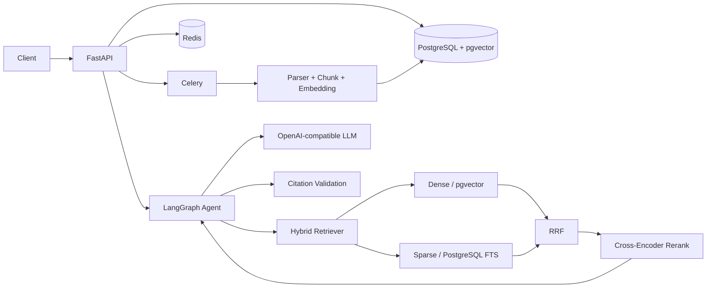

# TraceRAG 中文说明

> English documentation: [README.md](README.md)

> **一句话：** 面向跨文档企业知识问答的可评测 Agentic RAG 系统，重点验证检索质量、Agent 执行边界与 Citation 可靠性。  
> `多格式摄取 → Dense + PostgreSQL FTS → RRF → Cross-Encoder Rerank → LangGraph Research Agent → Citation Validation`

## 30 秒看懂

| | |
|---|---|
| **解决问题** | 单次检索对跨文档问题覆盖不足，生成答案又需要可追溯、可校验的证据引用。 |
| **核心链路** | 异步文档摄取 + Hybrid Retrieval + 有界 Research Agent + Evidence 聚合 + Citation Validation。 |
| **评测证据** | 30 题检索/Agent Benchmark、逐题 raw artifacts、63 项自动化测试、真实 Docker 全栈验证。 |
| **关键优化** | 修复 lexical query 语义后 Sparse Recall@5 **0.0167→0.9833**；Rerank 候选池调优后 p50 **417 ms→329 ms（-21%）**。 |

## 核心能力

- **Hybrid Retrieval**：pgvector Dense Retrieval + PostgreSQL FTS Sparse Retrieval，经 RRF 融合并可选 Cross-Encoder Rerank。
- **Bounded Research Agent**：使用 LangGraph 显式建模 direct / retrieve / research 路径，工具参数经 Pydantic 校验，设置执行步数上限并捕获工具异常。
- **Grounded Citation**：返回前将 `[Sn]` 引用重新解析到本轮真实 evidence，无法解析的 Citation 不会直接返回。
- **异步 Ingestion**：支持 Markdown / HTML / TXT / PDF，SHA-256 去重，section-aware chunking，可使用 Celery + Redis worker。
- **可复现评测**：30 道自维护基准题，保存逐题 raw JSON/CSV、配置和摘要，不手填 Benchmark 数字。

## 已验证结果

| 项目 | 结果 |
|---|---|
| 自动化测试 | **63 passed**，`ruff check .` 通过 |
| Hybrid + Rerank | Recall@5 **0.9833**，MRR **0.9833** |
| Citation validity | **1.0000** |
| LLM-as-a-Judge | correctness **0.978**，groundedness **0.988** |
| Rerank 优化 | p50 **417 ms → 329 ms（-21%）**，Recall@5 **0.9722 → 0.9833** |

一个关键调试案例是 PostgreSQL lexical retrieval：原实现使用 `plainto_tsquery` 的 AND 语义，同时 `simple` 配置不移除停用词，导致 30 道题中 29 道 sparse 分支无结果。修复后 sparse Recall@5 从 **0.0167** 提升到 **0.9833**；最终 ablation 中达到 **1.0000**。

## 架构



## 快速运行

```bash
cp .env.example .env
docker compose up --build

docker compose exec api python scripts/seed_demo.py
docker compose exec api python scripts/ask.py \
  "Compare Business and Enterprise audit log retention and observability." --mode research
```

浏览器打开 `http://localhost:8000/` 查看 Demo，`http://localhost:8000/docs` 查看 OpenAPI。

不配置真实模型时可使用 `LLM_BACKEND=mock` 做工程链路测试；README 中的语义 Benchmark 均来自真实 OpenAI-compatible LLM。

## Benchmark 与工程记录

- 完整英文说明与实验表：[`README.md`](README.md)
- 逐问题原始结果：[`artifacts/benchmark/`](artifacts/benchmark/)
- 实际调试、失败实验和根因记录：[`DEBUG_REPORT.md`](DEBUG_REPORT.md)
- 从零运行验证：[`VALIDATION.txt`](VALIDATION.txt)

项目明确保留局限性：语料只有 7 篇 / 31 chunks，Recall@5 接近饱和，因此不能把小幅指标变化外推成通用结论；Reranker 在该小语料上没有提升 MRR，候选池参数也需要在更大语料上重新调优。
